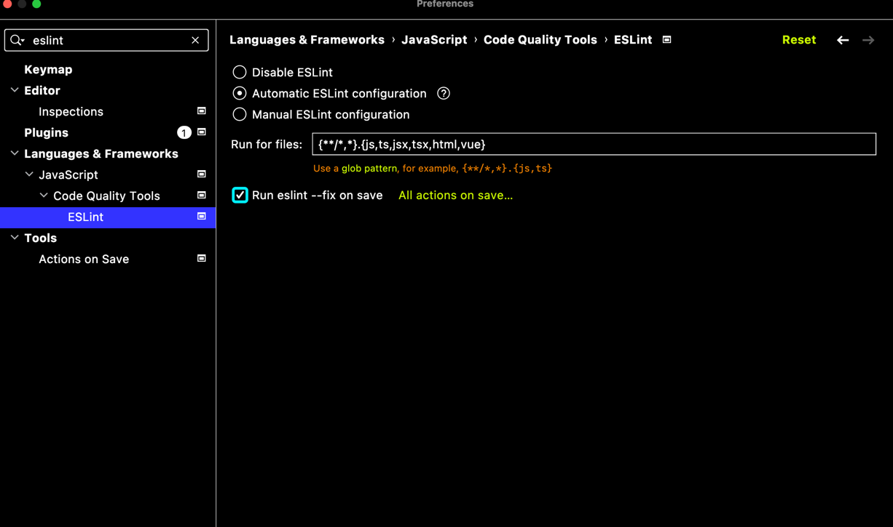

# Front Library Skeleton


## vite 프로젝트 초기화
> https://vitejs.dev/guide/#scaffolding-your-first-vite-project

```shell
yarn create vite front-lib-skeleton --template react-ts
```

## eslint 초기 설정  
> https://eslint.org/docs/latest/user-guide/getting-started

```shell
npm init @eslint/config

// Terminal Interactions
# ? What type of modules does your project use? … 
# ❯ JavaScript modules (import/export)
# ? Which framework does your project use? … 
# ❯ React
# ? Does your project use TypeScript? › Yes
# ? Where does your code run? …  (Press <space> to select, <a> to toggle all, <i> to invert selection)
# ✔ Node
# ? What format do you want your config file to be in? … 
# ❯ JSON
# ? Would you like to install them now? › Yes
# ? Which package manager do you want to use? … 
# ❯ yarn
```

- IntelliJ 사용시 auto fix 설정
   

## library 빌드를 위한 vite 설정   
> https://vitejs.dev/guide/build.html#library-mode   

1. vite.config.ts 에 build 관련 설정 추가

```diff
import { defineConfig } from 'vite'
import react from '@vitejs/plugin-react'
+ import { resolve } from 'path'   
/**
node 내장 모듈인 path 를 추가
이떄 type 추론을 위해 @types/node 모듈을 dev-dependency에 추가   
$ yarn add -D @types/node
*/

// https://vitejs.dev/config/
export default defineConfig({
  plugins: [react()],
  build: {
    lib: {
      entry: resolve(__dirname, 'src/comp/index.ts'), // 빌드가 시작되는 파일을 명시
      name: 'front-lib-skeleton',                     // 라이브러리 이름
      // the proper extensions will be added
      fileName: format => `index.${format}.js`        // 번들링된 최종 output 파일의 이름  
    },
    rollupOptions: {
      // make sure to externalize deps that shouldn't be bundled
      // into your library
      external: ['react'],                            // 라이브러리에 React 모듈이 같이 번들링되면 안되기 때문에 명시 (같이 변들링 되면 라이브러리를 실행하는 쪽 React 전역 변수와 충돌 가능성)
      output: {
        // Provide global variables to use in the UMD build
        // for externalized deps
        globals: {
          react: 'React'                              // 라이브러리에 React 모듈이 같이 번들링되면 안되기 때문에 명시 (SYNTAX =>  <<모듈 이름>> : <<변수 이름>> )      
        }
      }
    }
  }
})

```

## 라이브러리로 제공할 함수 구현   


## 테스트를 위한 Storybook 모듈 추가     


## 배포   


